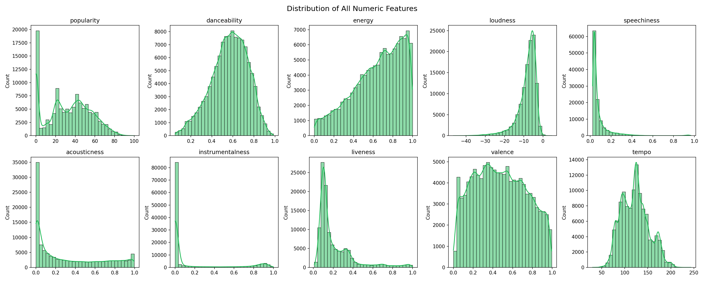
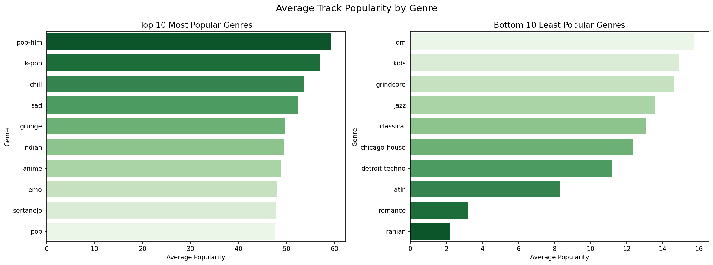
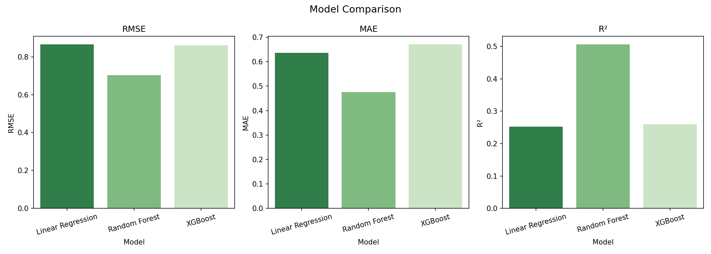

# Spotify Track Popularity Prediction

## Overview

A machine learning project analysing 113,843 Spotify tracks to predict
track popularity scores from audio features.

## Business Question

Which audio features and track characteristics best predict a song's
popularity on Spotify?

## Dataset

- Source: [Spotify Tracks Attributes and Popularity](https://www.kaggle.com/datasets/melissamonfared/spotify-tracks-attributes-and-popularity)
- 114,000 tracks with 21 features sourced from the Spotify API

## Project Structure

- Exploratory Data Analysis — distributions, missing values, genre trends, outliers
- Feature Engineering — encoding, log transformation, scaling, multicollinearity handling
- Modelling — Linear Regression, Random Forest, XGBoost
- Evaluation — RMSE, MAE, R²

## Results

| Model             | RMSE | MAE  | R²   |
| ----------------- | ---- | ---- | ---- |
| Linear Regression | 0.86 | 0.64 | 0.25 |
| Random Forest     | 0.70 | 0.48 | 0.51 |
| XGBoost           | 0.86 | 0.67 | 0.26 |

**Best model: Random Forest** with R² = 0.51

## Key Findings

- pop-film and k-pop are the highest popularity genres on Spotify
- No single audio feature strongly predicts popularity individually
- Combined audio features explain ~51% of popularity variance
- duration_ms, speechiness, energy, and valence are the most important predictors

## Visualisations

### Distributions

### Genre Popularity

### Model Comparison

## Tools & Libraries

Python | Pandas | Scikit-learn | XGBoost | Seaborn | Matplotlib

## How to Run

1. Clone the repo
2. Install dependencies: `pip install -r requirements.txt`
3. Open `Spotify_Track_Popularity_Analysis.ipynb` in Jupyter
4. Run all cells in order
